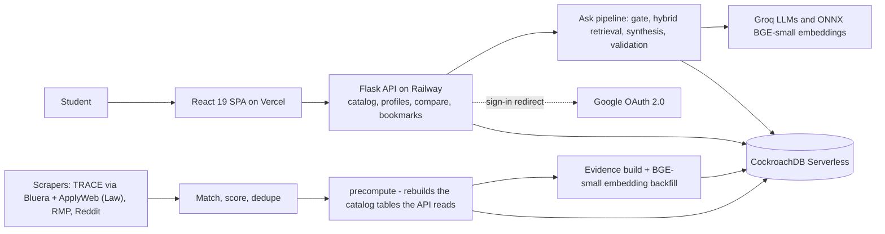

<div align="center">


# RateMyHusky

**Find the right professor, every semester.**

TRACE evaluations, RateMyProfessors ratings, and Reddit chatter for 9,300+ Northeastern professors — searchable, comparable, and answerable in one place.

[](https://ratemyhusky.com)
[](frontend)
[](frontend)
[](backend)
[](#architecture)

[**Visit the site**](https://ratemyhusky.com) · [Features](#features) · [Architecture](#architecture) · [Getting Started](#getting-started)


</div>

---

## Why RateMyHusky?

Choosing classes at Northeastern means juggling TRACE PDFs, RateMyProfessors tabs, and Reddit threads — each with a fragment of the picture. RateMyHusky unifies all three sources into a single profile per professor, then layers search, comparison, and an AI question-answering mode on top.

| Source | Scale |
|---|---|
| TRACE course evaluations | 1.7M+ student comments |
| RateMyProfessors | 43K+ ratings & reviews |
| Reddit (r/NEU and beyond) | ~9K verified professor mentions, sentiment-scored |
| Professor profiles | 9,300+ professors, 3,700+ photos, full course history |

## Features

### Explore
- **Professor catalog** — filter by college, department, rating, and review volume
- **Rich profile pages** — RMP ratings, TRACE in-depth scores, rating history, grade distributions, review feeds from all three sources, and related courses
- **Course catalog** — course detail pages with sections, ratings, and linked professors
- **Side-by-side compare** — stack any professors against each other
- **GOATED leaderboard** — top-rated professors by college
- **Search that keeps up** — instant autocomplete across professors and courses, plus a shuffle wheel for serendipity

### Ask (AI)
- **Ask a real question** — *"Is Rachlin a fair grader?"* — and get a cited, single-shot answer grounded in actual student reviews
- **Hybrid retrieval** — full-text search + 384-dim [BGE-small](https://huggingface.co/BAAI/bge-small-en-v1.5) embeddings fused with Reciprocal Rank Fusion over 1.5M+ review excerpts from RMP, TRACE, and Reddit
- **Citations that jump** — every cited snippet pins, scrolls to, and highlights its source on the professor page
- **Guardrailed** — prompt-injection gate, topic classifier, output validation, per-user abuse strikes, adaptive rate limiting, and answer caching

### Account
- **Bookmarks** — one-click bookmark toggle on professor and course cards/profiles, backed by a global bookmarks context for instant, optimistic updates
- **Bookmarks tab** — a dedicated view under Account listing all bookmarked professors and courses, reusing the catalog's card layout
- Signed-out bookmark clicks prompt Google sign-in instead of failing silently
- Profile/Bookmarks tabs share an animated sliding underline indicator

### Polished throughout
- Dark mode, responsive layout, breadcrumb navigation
- Google OAuth sign-in for gated functionality
- Precomputed catalog aggregates and prerendered pages for fast loads and SEO

## Architecture



**AI stack:** Groq-hosted Llama 3.1 8B as the input gate/classifier, GPT-OSS-120B for answer synthesis, and BGE-small-en-v1.5 (INT8 ONNX, pure `onnxruntime` — no torch) for query/document embeddings.

### Main technologies

| Layer | Technology |
|---|---|
| Frontend | React 19, TypeScript, Vite, React Router |
| Backend | Python, Flask, Flask-CORS, Flask-Limiter |
| Database | CockroachDB Serverless (psycopg2), native `VECTOR` search |
| AI / Retrieval | Groq (Llama 3.1 8B, GPT-OSS-120B), ONNX Runtime, BGE-small-en-v1.5, RRF hybrid retrieval |
| Auth | Google OAuth 2.0, JWT |
| Data pipeline | Python scrapers, professor-mention matching, sentiment scoring, embedding backfill |
| Hosting | Vercel (frontend) · Railway (backend) |

### Repository layout

```text
.
├── frontend/                  # React 19 + TypeScript SPA (Vercel)
│   └── src/
│       ├── pages/             #   Homepage, catalogs, profiles, compare,
│       │                      #   Account + AccountBookmarks
│       ├── components/        #   SearchBar (+ Ask mode), breadcrumbs,
│       │                      #   BookmarkButton, Navbar, ...
│       ├── context/           #   BookmarksContext (global bookmark state)
│       ├── api/               #   Typed backend client
│       └── utils/             #   Ask session persistence, citation pinning
├── backend/                   # Flask API (Railway)
│   ├── server.py              #   Routes, auth, connection pool
│   ├── bookmarks.py           #   Bookmark add/remove/list (pure functions)
│   ├── rag/                   #   Ask pipeline: gate, retrieve, answer,
│   │   │                      #   validate, cache, throttle, abuse,
│   │   │                      #   ONNX BGE-small query embeddings
│   │   └── eval/              #   Retrieval eval sets + RAG metrics
│   └── Better_Scraper/        #   TRACE/RMP scrapers + CSV outputs
└── scraper/                   # Reddit corpus + evidence/embedding pipeline
    ├── trace_pipeline/        #   Bluera TRACE per-term scrape → ingest → finalize
    └── applyweb_pipeline/     #   ApplyWeb XLS scrape → parse → ingest → verify
```

## Getting Started

### Prerequisites

- Python 3.8+ · Node.js 18+ · a reachable CockroachDB instance

### Backend

```bash
pip install -r backend/requirements.txt
```

Create `backend/.env`:

```env
CRDB_DATABASE_URL=<your-cockroachdb-connection-string>
JWT_SECRET=<generate-with-openssl-rand-hex-32>

# Optional — Google OAuth login flow
GOOGLE_CLIENT_ID=<your-google-oauth-client-id>
GOOGLE_CLIENT_SECRET=<your-google-oauth-client-secret>
FRONTEND_URL=http://localhost:5173

# Optional — AI Ask mode
GROQ_API_KEYS=<key1>,<key2>
```

```bash
python backend/server.py     # → http://localhost:5001
```

### Frontend

```bash
cd frontend
npm install
npm run dev                  # → http://localhost:5173
```

The dev frontend talks to the backend on port 5001 automatically.

---

<div align="center">

If RateMyHusky helped you dodge a 2.1-difficulty-but-somehow-brutal professor, star the repo.

</div>